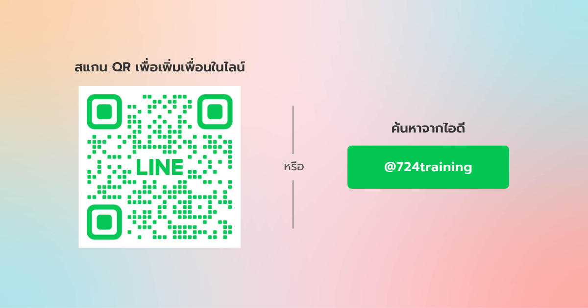

---
layout:
  title:
    visible: true
  description:
    visible: false
  tableOfContents:
    visible: true
  outline:
    visible: true
  pagination:
    visible: true
---

# คำถามที่พบบ่อย

<figure><figcaption></figcaption></figure>

<strong>การสมัครสมาชิกใช้เวลากี่วันจึงจะทราบผล?</strong>

* หากสมัคร **ก่อน 16:00 น.** จะทราบผลการสมัครภายในวันเดียวกัน
* หากสมัคร **หลัง 16:00 น.** จะทราบผลการสมัครในวันถัดไป

<strong>ช่องทางในการทราบผลการสมัครมีอะไรบ้าง?</strong>

คุณจะได้รับผลการสมัครผ่าน **SMS** ที่ส่งไปยังหมายเลขโทรศัพท์ที่ใช้ลงทะเบียนไว้

<strong>กรณียืนยันตัวตน (e-KYC) ไม่ผ่านเกณฑ์ ยังสามารถสมัครได้หรือไม่?</strong>

ได้ แม้ผลการยืนยันตัวตน (e-KYC) จะไม่ผ่านเกณฑ์ ระบบจะส่งข้อมูลของคุณไปยังเจ้าหน้าที่เพื่อทำการตรวจสอบและพิจารณาอนุมัติอีกครั้ง

<strong>แชร์ลิงก์สมัครแบบ Affiliate แล้วข้อมูลผู้แนะนำไม่ขึ้น?</strong>

สาเหตุอาจเกิดจาก **สถานะ Affiliate ของผู้แนะนำหมดอายุ** กรุณาต่ออายุสมาชิกก่อนเพื่อให้ข้อมูลผู้แนะนำแสดงผลตามปกติ ระบบจะอัปเดตและสามารถใช้งานได้ในวันถัดไป


**เพิ่มความสะดวกด้วย 724 Connext**

เพียงเชื่อมต่อกับ **724 Connext** เพื่อรับบริการที่ง่ายและสะดวกยิ่งขึ้น เช่น การตรวจสอบสถานะการสมัคร การติดตามข้อมูล หรือบริการอื่น ๆ ที่เกี่ยวข้อง ด้วยการเพิ่มเพื่อนใน LINE OA จาก QR Code ด้านล่าง หรือพิมพ์ค้นหาเพื่อน **"@724training"**



<figure><figcaption></figcaption></figure>
