---
layout:
  title:
    visible: true
  description:
    visible: false
  tableOfContents:
    visible: true
  outline:
    visible: true
  pagination:
    visible: true
---

# ขั้นตอนในการสมัคร

สำหรับการสมัครสมาชิกศรีกรุงโบรคเกอร์ คุณสามารถทำได้โดยเปิดเว็บเบราว์เซอร์แล้วพิมพ์ที่อยู่ (URL) ต่อไปนี้

> [**ag.724.co.th/srikrung**](https://ag.724.co.th/srikrung) หรือ [**bit.ly/srikrung-registration**](https://bit.ly/srikrung-registration)
>
> หรือสแกน QR ด้านล่าง
>
> 

เมื่อเข้าลิงก์ คุณจะพบหน้าจอเริ่มต้นที่มีลักษณะดังนี้

<figure>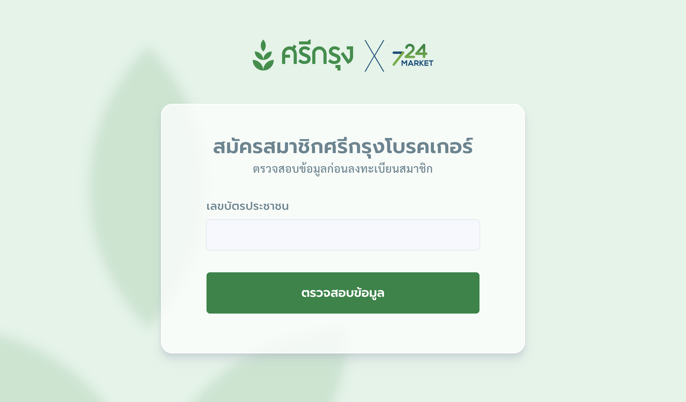<figcaption>
หน้าจอเริ่มต้นสำหรับสมัครสมาชิกศรีกรุงโบรคเกอร์
</figcaption></figure>

***

### กรณีได้รับลิงก์จากผู้แนะนำ 

หากคุณได้รับลิงก์สมัครสมาชิกจาก **ผู้แนะนำ** หน้าจอจะแสดงข้อมูลของผู้แนะนำ เช่น ชื่อและรายละเอียดอื่นๆ โปรดตรวจสอบให้แน่ใจว่าเป็นผู้แนะนำของคุณ

* หากข้อมูลถูกต้อง: สามารถดำเนินการสมัครต่อได้ทันที
* หากข้อมูลไม่ถูกต้อง: กรุณาติดต่อผู้แนะนำของคุณก่อนดำเนินการสมัคร

ตัวอย่างหน้าจอกรณีมีข้อมูลผู้แนะนำ

<figure><figcaption>
กรณีมีผู้แนะนำ หน้าจอจะแสดงข้อมูลของผู้แนะนำ
</figcaption></figure>

***

### ตรวจสอบข้อมูลผู้สมัคร 

ขั้นตอนแรกของการสมัครคือการตรวจสอบหมายเลขบัตรประชาชนของผู้สมัคร

* หากตรวจสอบแล้ว **สามารถสมัครได้** ระบบจะนำคุณไปยังหน้ากรอกข้อมูลส่วนตัว
* หากตรวจสอบแล้ว **ไม่สามารถสมัครได้** ระบบจะแสดงเหตุผล เช่น คุณเป็นสมาชิกอยู่แล้ว

<figure>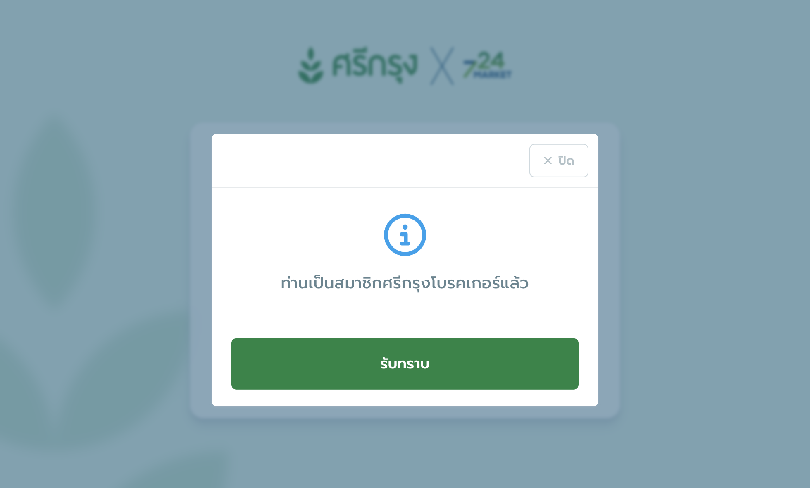<figcaption>
กรณีไม่สามารถสมัครสมาชิกได้ เนื่องจากเป็นสมาชิกอยู่แล้ว
</figcaption></figure>

***

### ข้อมูลผู้สมัคร 

เมื่อตรวจสอบข้อมูลผู้สมัครแล้ว หน้าจอจะแสดงแบบฟอร์มสำหรับกรอกข้อมูลของผู้สมัคร

<figure>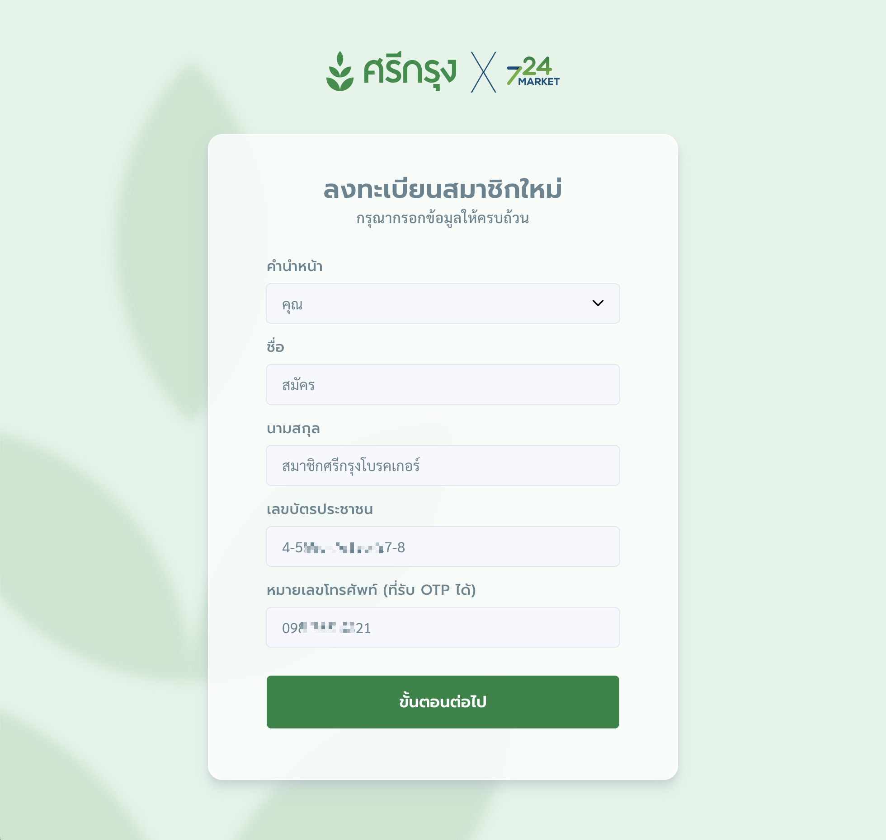<figcaption>
หน้ากรอกข้อมูลผู้สมัคร
</figcaption></figure>

กรุณากรอกข้อมูลให้ครบถ้วนและถูกต้อง โดยข้อมูลที่ต้องกรอกได้แก่

* คำนำหน้า
* ชื่อ
* นามสกุล
* เลขบัตรประชาชน
* หมายเลขโทรศัพท์ที่สามารถรับ OTP ได้ (**1 หมายเลข ต่อ 1 ผู้สมัคร**)

เมื่อกรอกข้อมูลครบแล้ว กดปุ่ม **"ขั้นตอนต่อไป"** เพื่อยืนยันหมายเลขโทรศัพท์ผ่าน OTP

***

### ยืนยัน OTP 

<figure>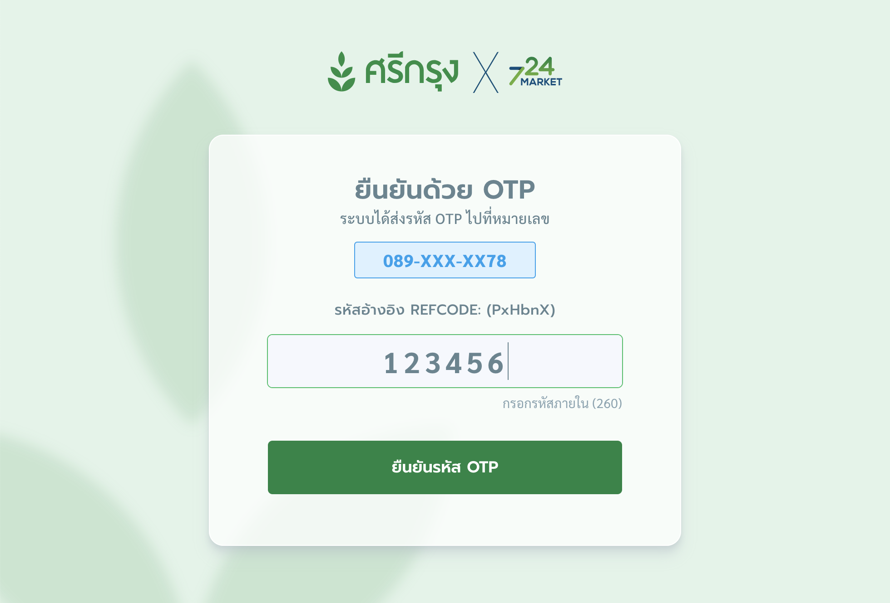<figcaption>
ยืนยันหมายเลขโทรศัพท์ด้วย OTP
</figcaption></figure>

เพื่อความปลอดภัย ระบบจะส่งรหัส OTP (6 หลัก) ไปยังหมายเลขโทรศัพท์ที่คุณระบุไว้

1. ตรวจสอบรหัสอ้างอิง (REFCODE) บนหน้าจอให้ตรงกับในข้อความ OTP
2. หากรหัสตรงกัน ให้กรอกรหัส OTP ภายในเวลาที่กำหนด (5 นาที)
3. หากไม่ได้รับ OTP สามารถกด **"ส่งรหัส OTP อีกครั้ง"** หลังเวลาที่หน้าจอกำหนด

หลังจากกรอก OTP ให้กดปุ่ม **"ยืนยันรหัส OTP"** เพื่อไปยังขั้นตอนถัดไป

***

### ข้อมูลส่วนตัว 

หลังจากยืนยัน OTP สำเร็จ ระบบจะแสดงแบบฟอร์มสำหรับกรอกข้อมูลส่วนตัวในส่วนแรก

<figure>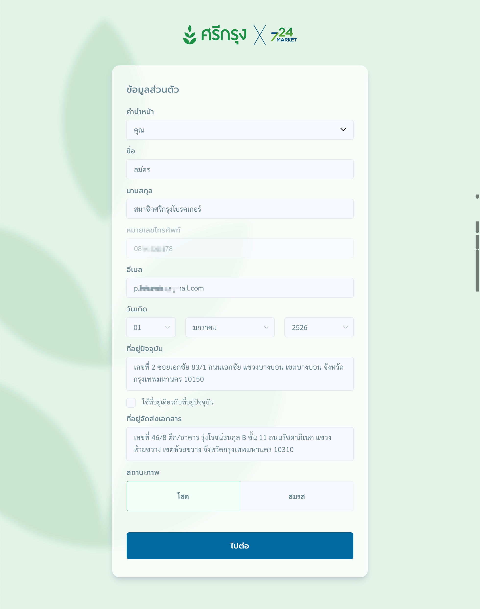<figcaption>
ฟอร์มกรอกข้อมูลส่วนตัว
</figcaption></figure>

ข้อมูลที่ต้องกรอกเพิ่มเติมมีดังนี้

* อีเมล
* วัน/เดือน/ปี เกิด
* ที่อยู่ปัจจุบัน
* ที่อยู่จัดส่งเอกสาร (หากใช้ที่อยู่เดียวกับที่อยู่ปัจจุบัน ให้กดเลือกใช้ข้อมูลเดียวกัน)
* สถานภาพ

<figure>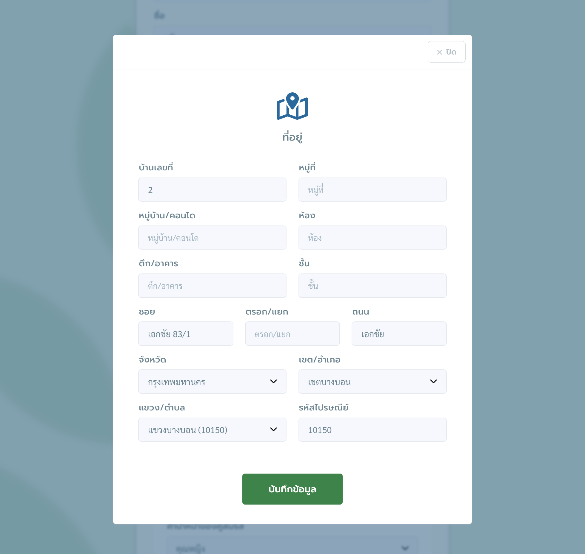<figcaption>
หน้าจอสำหรับกรอกที่อยู่
</figcaption></figure>

### การกรอกข้อมูลสถานภาพ 

* **กรณีโสด:** ไม่ต้องกรอกข้อมูลเพิ่มเติม
* **กรณีสมรส:** ต้องกรอกข้อมูลของคู่สมรสเพิ่มเติม ได้แก่
  * คำนำหน้า
  * ชื่อ
  * นามสกุล

<figure>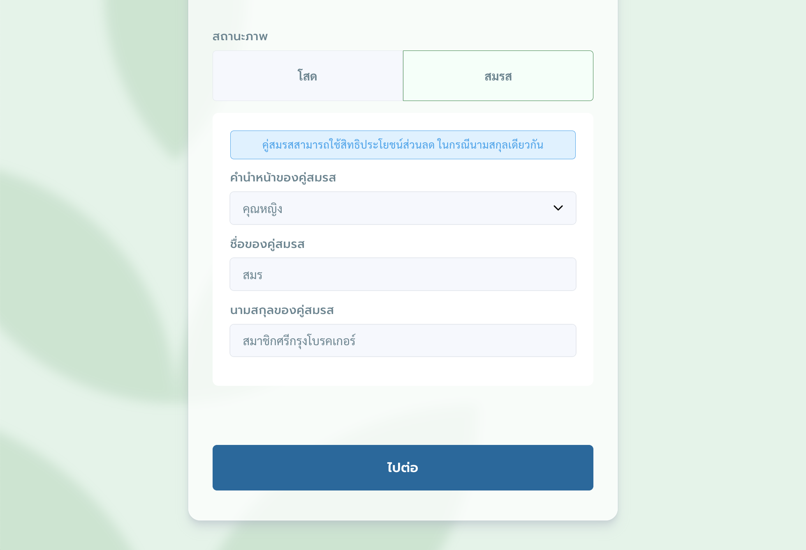<figcaption>
กรณีมีคู่สมรส ระบบจะแสดงช่องให้กรอกข้อมูลคู่สมรส
</figcaption></figure>


**หมายเหตุ:** คู่สมรสสามารถใช้สิทธิประโยชน์ส่วนลด หากนามสกุลตรงกัน


เมื่อกรอกข้อมูลส่วนตัวเรียบร้อยแล้ว ให้กดปุ่ม **"ไปต่อ"** เพื่อดำเนินการในขั้นตอนถัดไป

***

### ข้อมูลผู้รับมรดกค่าสายงาน 

ในส่วนนี้ คุณต้องกรอกข้อมูล **ผู้รับมรดกค่าสายงาน** ซึ่งจะได้รับผลประโยชน์ในกรณีเกิดเหตุสุดวิสัย ข้อมูลที่กรอกควรเป็นความจริงและถูกต้อง

<figure>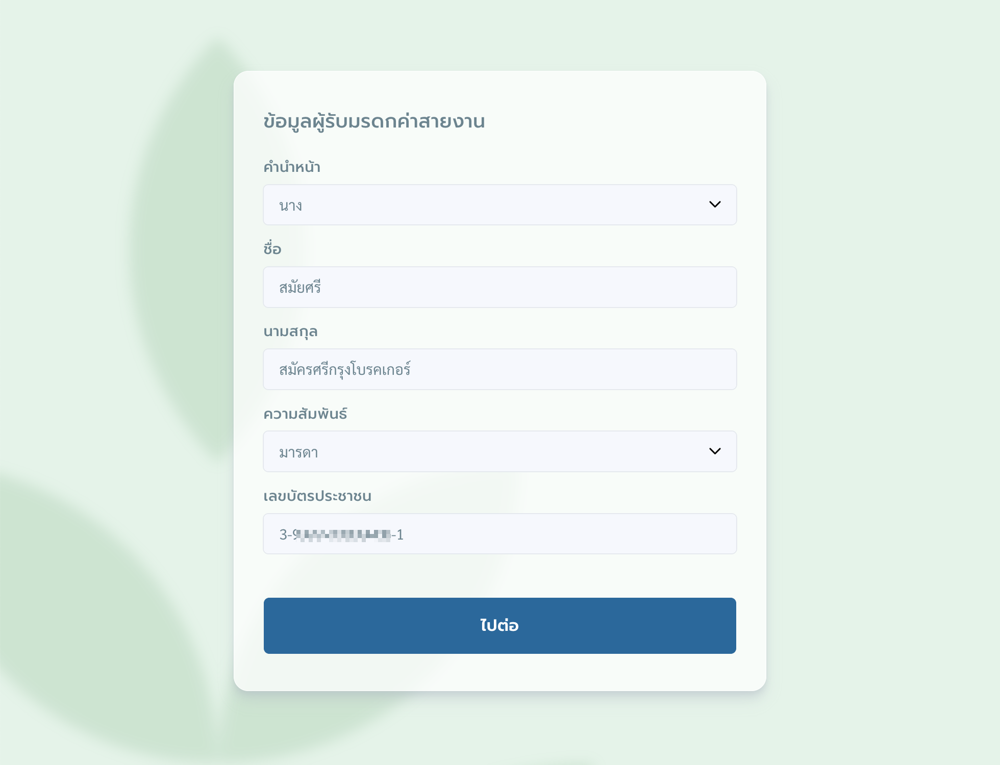<figcaption>
ฟอร์มกรอกข้อมูลผู้รับมรดกค่าสายงาน
</figcaption></figure>

ข้อมูลที่ต้องกรอกมีดังนี้

* คำนำหน้า
* ชื่อ
* นามสกุล
* ความสัมพันธ์
* เลขบัตรประชาชน

เมื่อกรอกข้อมูลครบถ้วนแล้ว กดปุ่ม **"ไปต่อ"** เพื่อดำเนินการในขั้นตอนถัดไป

***

### ข้อมูลบัตรนายหน้า 

<figure>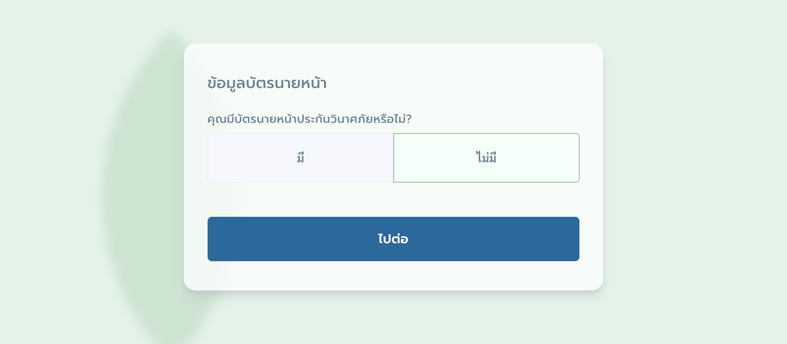<figcaption>
ฟอร์มกรอกข้อมูลบัตรนายหน้าประกันวินาศภัย
</figcaption></figure>

* หาก **ไม่มีใบอนุญาตนายหน้าประกันวินาศภัย** สามารถกดปุ่ม **"ไปต่อ"** เพื่อข้ามขั้นตอนนี้ได้ทันที
* หาก **มีใบอนุญาตฯ** ระบบจะเชื่อมต่อและตรวจสอบข้อมูลโดยตรง กับสำนักงานคณะกรรมการกำกับและส่งเสริมการประกอบธุรกิจประกันภัย (คปภ.)

<figure>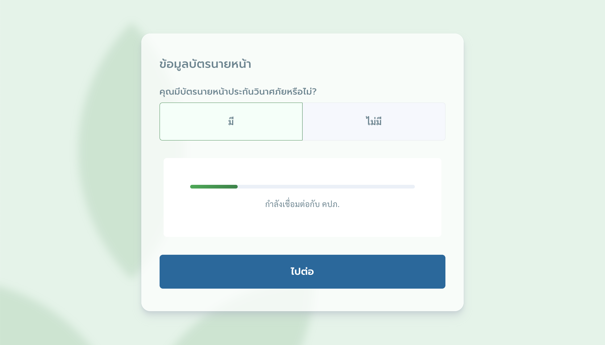<figcaption>
ระบบกำลังเชื่อมต่อข้อมูลกับ คปภ.
</figcaption></figure>

หากระบบไม่พบข้อมูลจาก คปภ. ผู้สมัครจะต้องกรอกข้อมูลด้วยตนเอง โดยระบุ

* เลขที่ใบอนุญาต
* วันออกใบอนุญาต
* วันใบอนุญาตหมดอายุ

<figure>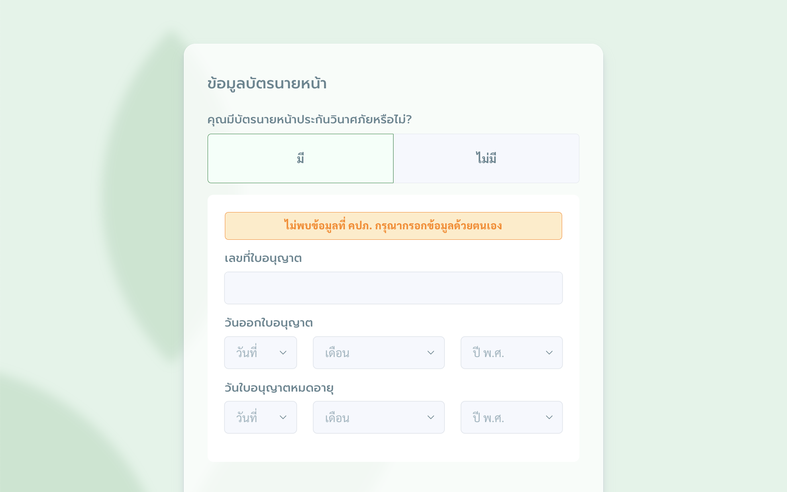<figcaption>
กรณีต้องกรอกข้อมูลบัตรนายหน้าด้วยตัวเอง
</figcaption></figure>

***

### ข้อมูลธนาคารสำหรับรับค่าสายงาน 

สำหรับผู้สมัครที่มีใบอนุญาตนายหน้าประกันวินาศภัย จะได้รับสิทธิ์รับค่าสายงานตามผลประโยชน์ของสมาชิก โดยต้องกรอกข้อมูลบัญชีธนาคารให้ถูกต้องเพื่อการโอนเงิน

<figure><figcaption>
ฟอร์มกรอกข้อมูลธนาคารสำหรับรับค่าสายงาน
</figcaption></figure>

ข้อมูลที่ต้องกรอกประกอบด้วย

* ชื่อธนาคาร
* ประเภทบัญชี
* สาขาธนาคาร
* เลขบัญชี


**หมายเหตุ:**  
ชื่อผู้สมัครต้องตรงกับชื่อบัญชีธนาคารที่ระบุ และกรุณาตรวจสอบข้อมูลให้ถูกต้อง เพื่อป้องกันความผิดพลาดในการโอนเงิน


เมื่อกรอกและตรวจสอบข้อมูลครบถ้วนแล้ว กดปุ่ม **"ไปต่อ"** เพื่อดำเนินการในขั้นตอนถัดไป

***

***

***

ในการสมัครสมาชิกศรีกรุงโบรคเกอร์ เริ่มต้นจากพิมพ์ URL เพื่อเข้าสู่หน้าเว็บไซด์ของระบบคือ [https://ag.724.co.th/srikrung](https://ag.724.co.th/srikrung) ระบบจะแสดงหน้าจอการทำงานแบ่งออกเป็น 2 กรณี

**กรณีมีผู้แนะนำ**

<figure><figcaption></figcaption></figure>

ผู้แนะนำแสดงข้อมูลดังนี้

* รูปภาพสมาชิก (ถ้ามี)
* ชื่อ นามสกุล
* รหัสสมาชิก

**กรณีไม่มีผู้แนะนำ**

<figure><figcaption></figcaption></figure>

ขั้นตอนการทำงาน ดังนี้

กรอกหมายเลขบัตรประชาชน 13 หลักของผู้สมัคร แล้วกดปุ่ม "ตรวจสอบข้อมูล" ระบบจะตรวจสอบหมายเลขบัตรประชาชนว่าผู้สมัครเคยเป็นสมาชิกในระบบหรือไม่ หากผู้สมัครไม่เคยเป็นสมาชิกมาก่อน ระบบจะแสดงหน้าจอลงทะเบียนสมาชิกใหม่ให้ทำรายการ

<figure><figcaption></figcaption></figure>

ผู้สมัครต้องกรอกข้อมูลให้ครบถ้วน

* คำนำหน้า
* ชื่อ
* นามสกุล
* เลขบัตรประชาชน
* อีเมล
* หมายเลขโทรศัพท์ที่รับ OTP ได้ **(1 หมายเลข / 1 ผู้สมัคร)**
* กดปุ่ม "ขั้นตอนต่อไป" ระบบจะแสดงส่วนของ ข้อมูลส่วนตัว ให้ทำรายการ

### ข้อมูลส่วนตัว

<figure><figcaption></figcaption></figure>

ขั้นตอนการกรอกข้อมูลส่วนตัวเพิ่มเติม โดยผู้สมัครต้องกรอกข้อมูล ดังนี้

* วัน/เดือน/ปี เกิด
* กรอกข้อมูลที่อยู่ปัจจุบัน แล้วกดปุ่ม "บันทึกข้อมูล" ตามรูปด้านล่าง
* ที่อยู่จัดส่งเอกสาร (ในกรณีใช้ที่อยู่เดียวกับที่อยู่ปัจจุบันสามารถกดเลือกใช้ข้อมูลเดียวกันได้)

<figure><figcaption></figcaption></figure>

* สถานะภาพ (กรณีโสด ไม่ต้องกรอกข้อมูล)

<figure><figcaption></figcaption></figure>

กรณีสมรส กรอกข้อมูลของคู่สมรสเพิ่มเติม

* คำนำหน้าของคู่สมรส
* ชื่อของคู่สมรส
* นามสกุลของคู่สมรส (คู่สมรสสามารถใช้สิทธิประโยชน์ส่วนลด ในกรณีนามสกุลเดียวกัน)
* กดปุ่ม "ไปต่อ" ระบบจะแสดงส่วนของ ข้อมูลผู้รับมรดกค่าสายงาน ให้ทำรายการ

### ข้อมูลผู้รับมรดกค่าสายงาน

<figure><figcaption></figcaption></figure>

ขั้นตอนการกรอกข้อมูลผู้รับมรดกค่าสาย โดยผู้สมัครต้องกรอกข้อมูล ดังนี้

* คำนำหน้า
* ชื่อ
* นามสกุล
* ความสัมพันธ์
* เลขบัตรประชาชน
* กดปุ่ม "ไปต่อ" ระบบจะแสดงส่วนของ ข้อมูลธนาคาร ให้ทำรายการ

### ข้อมูลบัตรนายหน้า

ระบบจะตรวจสอบข้อมูลจาก คปภ.โดยตรง ในกรณีที่ผู้สมัครมีข้อมูลบัตรนายหน้าประกันวินาศภัย

<figure><figcaption></figcaption></figure>

ในกรณีที่ไม่สามารถเชื่อมต่อกับข้อมูลของ คปภ. ผู้สมัครต้องการกรอกบัตรนายหน้าประกันวินาศภัยด้วยตนเองต้องกรอกข้อมูล ดังนี้

* เลขที่ใบอนุญาต
* วันออกใบอนุญาต
* วันใบอนุญาตหมดอายุ

### ข้อมูลธนาคาร

ขั้นตอนการกรอกข้อมูลธนาคาร โดยผู้สมัครต้องกรอกข้อมูล ดังนี้

* ชื่อบัญชี ระบบแสดงตามชื่อ-นามสกุล จากขั้นตอนการกรอกข้อมูลส่วนตัว
* ธนาคาร กดเลือกธนาคาร ที่ผู้สมัครต้องการแจ้งข้อมูล
* ประเภทบัญชี
* สาขา
* เลขบัญชี

ในกรณีไม่มีไม่ต้องกรอกข้อมูล

<figure><figcaption></figcaption></figure>

กดปุ่ม "ไปต่อ" ระบบจะแสดงส่วนของ ข้อกำหนดและเงื่อนไขการเป็นสมาชิก ให้ทำรายการ

### ข้อกำหนดและเงื่อนไขการเป็นสมาชิก

<figure><figcaption></figcaption></figure>

ขั้นตอนการยอมรับข้อกำหนดและเงื่อนไขการเป็นสมาชิก ผู้สมัครอ่านเงื่อนไขการเป็นสมาชิกจนครบถ้วนแล้ว ต้องกรอกข้อมูล ดังนี้

* คลิกเครื่องหมายถูกหน้าข้อความ ข้าพเจ้าอ่านและเข้าใจในข้อตกลง เงื่อนไขต่างๆ รวมถึงยอมรับข้อกำหนดในการเป็นสมาชิกของ บริษัท ศรีกรุงโบรคเกอร์ จำกัด
* เซ็นลายเซ็นของผู้สมัคร แล้วกดปุ่มบันทึก หรือหากต้องการแก้ไขให้กดปุ่มเซ็นใหม่
* กดปุ่ม "ยืนยันข้อมูลถูกต้อง" ระบบจะแสดงส่วนของ นโยบายคุ้มครองข้อมูลส่วนบุคคล ให้ทำรายการ

### นโยบายคุ้มครองข้อมูลส่วนบุคคล

<figure><figcaption></figcaption></figure>

ขั้นตอนการยอมรับข้อกำหนดและเงื่อนไขการเป็นสมาชิก ผู้สมัครอ่านเงื่อนไขการเป็นสมาชิกจนครบถ้วนแล้ว ต้องกรอกข้อมูล ดังนี้ แล้วกดปุ่ม "รับทราบนโยบายข้อมูลส่วนบุคคล"

* คลิกเครื่องหมายถูกหน้าข้อความ ข้าพเจ้าอ่านและรับทราบนโยบายข้อมูลส่วนบุคคลของ บริษัท ศรีกรุงโบรคเกอร์ จำกัด

หลังจากยอมรับเงื่อนไขทั้งหมดแล้ว ระบบจะแสดงค่าสมัครสมาชิก โดยบริษัท ศรีกรุงโบรคเกอร์ จำกัด จะมอบประกันอุบัติเหตุส่วนบุคคล (PA: Personal Accident Insurance) ฟรีให้กับผู้สมัครทุกคน หากผู้สมัครต้องการเพิ่มความคุ้มครอง สามารถทำรายการเพิ่มเติมได้จากหน้าจอการทำงาน

### ข้อมูลผู้รับผลประโยชน์ของประกันอุบัติเหตุส่วนบุคคล

<figure><figcaption></figcaption></figure>

ประกันอุบัติเหตุส่วนบุคคล (PA) จะแสดงข้อมูลเบื้องต้นตามแพ็คเกจเริ่มต้นตามอายุของผู้สมัคร หากผู้สมัครต้องการเพิ่มความคุ้มครองหรือเลือกแผนที่มีค่ารักษาพยาบาล กดปุ่ม "เพิ่มความคุ้มครอง" ระบบจะแสดงหน้าต่างเพิ่มความคุ้มครอง

<figure><figcaption></figcaption></figure>

**กรณีเลือกเพิ่มความคุ้มครองประกันอุบัติเหตุส่วนบุคคล**

<figure><figcaption></figcaption></figure>

หลังจากเลือกข้อมูลเสร็จสิ้นแล้ว ระบบจะแสดงข้อมูลแผนประกันอุบัติเหตุส่วนบุคคล (PA) ที่เพิ่มความคุ้มครอง และแสดงข้อมูลผู้รับผลประโยชน์คือ ทายาทโดยธรรม หลังจากผู้สมัครกดปุ่ม "ขั้นตอนต่อไป" เพื่อเข้าสู่ขั้นตอนการยืนยันตัวตน

### การยืนยันตัวตนทางอิเล็กทรอนิกส์ (E-KYC)

<figure><figcaption></figcaption></figure>

ขั้นตอนการยืนยันตัวตนทางอิเล็กทรอนิกส์ (E-KYC) ต้องทำรายการ ดังนี้ คลิกปุ่ม "คลิกเพื่อเปิดกล้อง" เพื่อให้ระบบเข้าถึงการใช้งานกล้องบนอุปกรณ์ของผู้ใช้งาน

**ขั้นตอนที่ 1 ถ่ายรูปบัตรประชาชน**

* เปิดเผยข้อมูลบนบัตรประชาชนเฉพาะ
  * เลขที่บัตรประจำตัวประชาชน 13 หลัก
  * ชื่อและนามสกุล
  * ภาพใบหน้าบนบัตรประชาชน
* จัดบัตรประชาชนให้อยู่ภายในกรอบที่กำหนด
* ถ่ายรูปในที่ที่มีแสงสว่างเพียงพอ ไม่สว่างหรือมีดจนเกินไป
* รูปถ่ายด้านหน้าบัตรประชาชนต้องชัดเจน ไม่มีรอยขูดขีด
* หลีกเลี่ยงแสงสะท้อนที่อาจเกิดขึ้นบนตัวบัตรประชาชน

<figure><figcaption></figcaption></figure>

* หลังจากเปิดกล้องแล้ว ระบบจะแสดงกรอบบัตรประชาชน และแสดงข้อความแจ้งเตือนเลขบัตรประชาชนต้องตรงกับเลขบัตรประชาชนที่ใช้สมัครเท่านั้น
* กดปุ่ม "ถ่ายรูปบัตรประชาชน" เพื่อทำการถ่ายหน้าบัตรประชาชนของผู้สมัคร

<figure><figcaption></figcaption></figure>

* หากผู้ใช้งานต้องการถ่ายรูปใหม่อีกครั้งเนื่องจากรูปเบลอ ให้กดปุ่ม "ถ่ายใหม่อีกครั้ง" หรือ "เลือกรูปจากคลัง" ข้อมูลบนอุปกรณ์ก็สามารถทำได้ ระบบจะเปิดแหล่งเก็บไฟล์ให้ผู้ใช้งานเลือกรูปบัตรประชาชนจากแหล่งเก็บข้อมูล
* ในกรณีผู้ใช้งานเลือกรูปจากคลัง ระบบจะแสดงรูปบัตรประชาชนที่ได้อัพโหลด
* กดปุ่ม "ไปต่อ ขั้นตอนที่ 2" ระบบจะแสดงส่วนขั้นตอนที่ 2 ถ่ายรูปตัวตนบุคคล

<figure><figcaption></figcaption></figure>

**ขั้นตอนที่ 2 ถ่ายรูปตัวบุคคล**

* ไม่สวมหมวก แว่นตา หน้ากากอนามัย หรือเครื่องประดับต่างๆ ที่ปิดบังใบหน้า
* จัดใบหน้าให้อยู่ภายในกรอบที่กำหนด
* ไม่กระพริบตา หรี่ตา หรือทำรูปปากที่ผิดปกติ
* ถ่ายรูปในที่ที่มีแสงสว่างเพียงพอ ไม่สว่างหรือมืดจนเกินไป

<figure><figcaption></figcaption></figure>

* หากผู้ใช้งานต้องการถ่ายรูปใหม่อีกครั้งเนื่องจากรูปเบลอ ให้กดปุ่ม "ถ่ายใหม่อีกครั้ง"
* กดปุ่ม "ยืนยันข้อมูล" ระบบจะตรวจสอบข้อมูลความถูกต้อง ดังนี้
  * เลขบัตรประจำตัวประชาชน 13 หลักว่าตรงกับข้อมูลขั้นตอนการตรวจสอบเลขบัตรประชาชนก่อนลงทะเบียนหรือไม่
  * ใบหน้าบนบัตรประชาชนและใบหน้ารูปถ่ายยืนยันตัวตนส่วนบุคลว่าเป็นบุคคลเดียวกันหรือไม่

**กรณีการยืนยันตัวตน (E-KYC) ผลการยืนยันตัวตน: สำเร็จ**

ระบบจะแสดงหน้าจอสรุปข้อมูลสมาชิกที่ผู้สมัครกรอกเข้ามาทั้งหมดทั้ง 2 กรณี " สำเร็จ" หรือ "ไม่ผ่านเกณฑ์" เพื่อให้ตรวจสอบอีกครั้ง หากพบว่าข้อมูลมีความผิดพลาด ผู้สมัครสามารถกดปุ่ม "แก้ไขข้อมูล" เพื่อกลับไปที่ส่วนที่ต้องการแก้ไขได้ (ยกเว้นเลขบัตรประชาชนที่ไม่สามารถแก้ไขได้)

<figure><figcaption></figcaption></figure>

**กรณีการยืนยันตัวตน (E-KYC) ผลการยืนยันตัวตน: ไม่ผ่านเกณฑ์**

ในกรณีไม่ผ่านเกณฑ์ ระบบจะส่งข้อมูลรูปถ่ายบัตรประชาชนและรูปถ่ายยืนยันตัวตนส่วนบุคคลไปให้ เจ้าหน้าที่ตรวจสอบอีกครั้ง

หลังจากตรวจสอบข้อมูลทั้งหมดครบถ้วนแล้วผู้สมัครต้องกดปุ่ม "ยืนยันข้อมูลและชำระเงิน" เพื่อทำการชำระเงินค่าสมัคร

### การชำระเงิน

<figure><figcaption></figcaption></figure>

ผู้สมัครสามารถบันทึกข้อมูล QR Code เพื่อนำไปเปิดในแอปพลิเคชันของธนาคาร หากสมัครผ่านสมาร์ทโฟนโดยตรง หรือหากใช้อุปกรณ์อื่นในการสมัคร ก็สามารถใช้สมาร์ทโฟนที่มีแอปพลิเคชันธนาคารสแกน QR Code บนหน้าจอได้ทันที

หลังจากที่การชำระเงินเสร็จสมบูรณ์แล้ว ระบบจะแสดงหน้าจอที่ยืนยันการชำระเงินเรียบร้อย ในขั้นตอนถัดไป เจ้าหน้าที่จะทำการตรวจสอบข้อมูลทั้งหมดและจะแจ้งผลการอนุมัติให้ผู้ใช้งานทราบภายในเวลาไม่เกิน 2 วันทำการหลังจากการตรวจสอบเสร็จสิ้น

<figure><figcaption></figcaption></figure>
