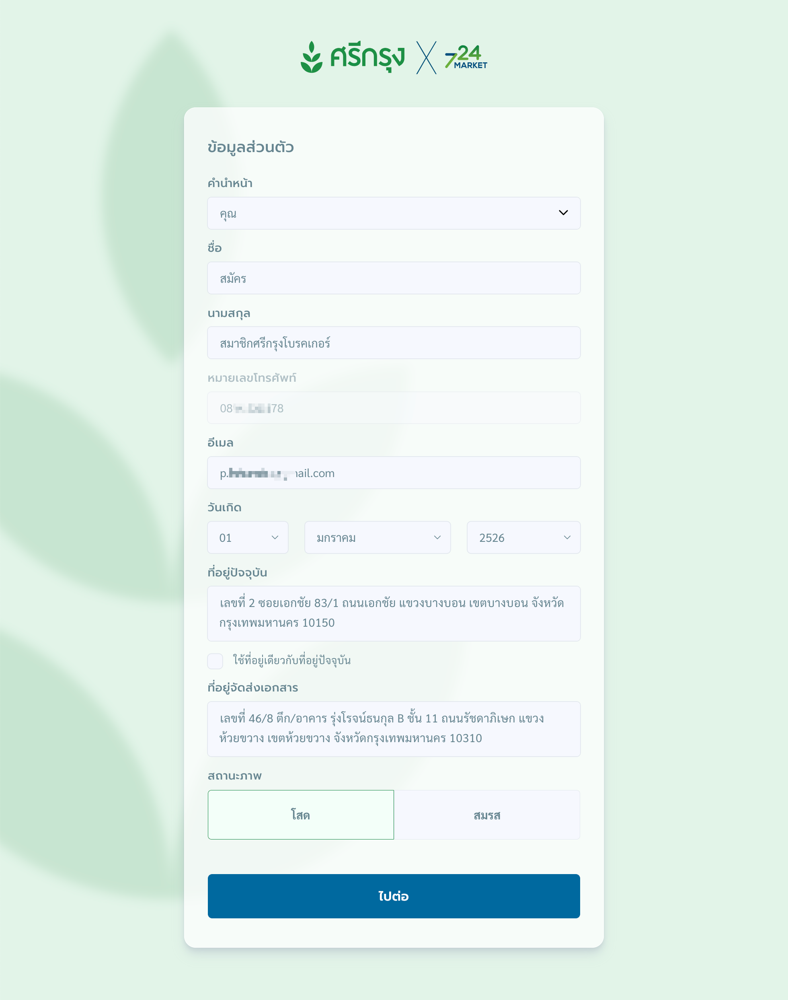
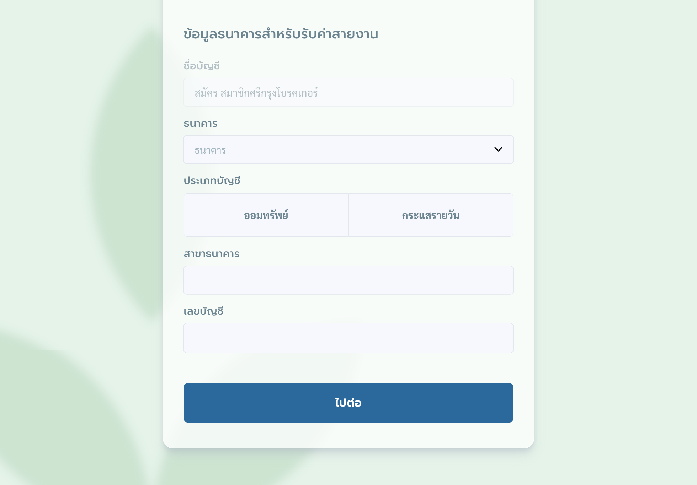
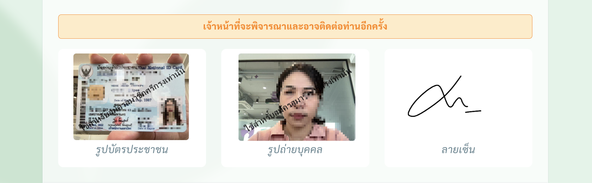

---
layout:
  title:
    visible: true
  description:
    visible: false
  tableOfContents:
    visible: true
  outline:
    visible: true
  pagination:
    visible: true
---

# ขั้นตอนในการสมัคร

สำหรับการสมัครสมาชิกศรีกรุงโบรคเกอร์ คุณสามารถทำได้โดยเปิดเว็บเบราว์เซอร์แล้วพิมพ์ที่อยู่ (URL) ต่อไปนี้

> [**ag.724.co.th/srikrung**](https://ag.724.co.th/srikrung) หรือสแกน QR ด้านล่าง
>
> 

เมื่อเข้าลิงก์ คุณจะพบหน้าจอเริ่มต้นที่มีลักษณะดังนี้

<figure><figcaption>
หน้าจอเริ่มต้นสำหรับสมัครสมาชิกศรีกรุงโบรคเกอร์
</figcaption></figure>

***

### กรณีได้รับลิงก์จากผู้แนะนำ 

หากคุณได้รับลิงก์สมัครสมาชิกจาก **ผู้แนะนำ** หน้าจอจะแสดงข้อมูลของผู้แนะนำ เช่น ชื่อและรายละเอียดอื่นๆ โปรดตรวจสอบให้แน่ใจว่าเป็นผู้แนะนำของคุณ

* หากข้อมูลถูกต้อง: สามารถดำเนินการสมัครต่อได้ทันที
* หากข้อมูลไม่ถูกต้อง: กรุณาติดต่อผู้แนะนำของคุณก่อนดำเนินการสมัคร

ตัวอย่างหน้าจอกรณีมีข้อมูลผู้แนะนำ

<figure><figcaption>
กรณีมีผู้แนะนำ หน้าจอจะแสดงข้อมูลของผู้แนะนำ
</figcaption></figure>

***

### ตรวจสอบข้อมูลผู้สมัคร 

ขั้นตอนแรกของการสมัครคือการตรวจสอบหมายเลขบัตรประชาชนของผู้สมัคร

* หากตรวจสอบแล้ว **สามารถสมัครได้** ระบบจะนำคุณไปยังหน้ากรอกข้อมูลส่วนตัว
* หากตรวจสอบแล้ว **ไม่สามารถสมัครได้** ระบบจะแสดงเหตุผล เช่น คุณเป็นสมาชิกอยู่แล้ว

<figure><figcaption>
กรณีไม่สามารถสมัครสมาชิกได้ เนื่องจากเป็นสมาชิกอยู่แล้ว
</figcaption></figure>

***

### ข้อมูลผู้สมัคร 

เมื่อตรวจสอบข้อมูลผู้สมัครแล้ว หน้าจอจะแสดงแบบฟอร์มสำหรับกรอกข้อมูลของผู้สมัคร

<figure><figcaption>
หน้ากรอกข้อมูลผู้สมัคร
</figcaption></figure>

กรุณากรอกข้อมูลให้ครบถ้วนและถูกต้อง โดยข้อมูลที่ต้องกรอกได้แก่

* คำนำหน้า
* ชื่อ
* นามสกุล
* เลขบัตรประชาชน
* หมายเลขโทรศัพท์ที่สามารถรับ OTP ได้ (**1 หมายเลข ต่อ 1 ผู้สมัคร**)

เมื่อกรอกข้อมูลครบแล้ว กดปุ่ม **"ขั้นตอนต่อไป"** เพื่อยืนยันหมายเลขโทรศัพท์ผ่าน OTP

***

### ยืนยัน OTP 

<figure><figcaption>
ยืนยันหมายเลขโทรศัพท์ด้วย OTP
</figcaption></figure>

เพื่อความปลอดภัย ระบบจะส่งรหัส OTP (6 หลัก) ไปยังหมายเลขโทรศัพท์ที่คุณระบุไว้

1. ตรวจสอบรหัสอ้างอิง (REFCODE) บนหน้าจอให้ตรงกับในข้อความ OTP
2. หากรหัสตรงกัน ให้กรอกรหัส OTP ภายในเวลาที่กำหนด (5 นาที)
3. หากไม่ได้รับ OTP สามารถกด **"ส่งรหัส OTP อีกครั้ง"** หลังเวลาที่หน้าจอกำหนด

หลังจากกรอก OTP ให้กดปุ่ม **"ยืนยันรหัส OTP"** เพื่อไปยังขั้นตอนถัดไป

***

### ข้อมูลส่วนตัว 

หลังจากยืนยัน OTP สำเร็จ ระบบจะแสดงแบบฟอร์มสำหรับกรอกข้อมูลส่วนตัวในส่วนแรก

<figure><figcaption>
ฟอร์มกรอกข้อมูลส่วนตัว
</figcaption></figure>

ข้อมูลที่ต้องกรอกเพิ่มเติมมีดังนี้

* อีเมล
* วัน/เดือน/ปี เกิด
* ที่อยู่ปัจจุบัน
* ที่อยู่จัดส่งเอกสาร (หากใช้ที่อยู่เดียวกับที่อยู่ปัจจุบัน ให้กดเลือกใช้ข้อมูลเดียวกัน)
* สถานภาพ

<figure><figcaption>
หน้าจอสำหรับกรอกที่อยู่
</figcaption></figure>

### การกรอกข้อมูลสถานภาพ 

* **กรณีโสด:** ไม่ต้องกรอกข้อมูลเพิ่มเติม
* **กรณีสมรส:** ต้องกรอกข้อมูลของคู่สมรสเพิ่มเติม ได้แก่
  * คำนำหน้า
  * ชื่อ
  * นามสกุล

<figure><figcaption>
กรณีมีคู่สมรส ระบบจะแสดงช่องให้กรอกข้อมูลคู่สมรส
</figcaption></figure>


**หมายเหตุ:** คู่สมรสสามารถใช้สิทธิประโยชน์ส่วนลด หากนามสกุลตรงกัน


เมื่อกรอกข้อมูลส่วนตัวเรียบร้อยแล้ว ให้กดปุ่ม **"ไปต่อ"** เพื่อดำเนินการในขั้นตอนถัดไป

***

### ข้อมูลผู้รับมรดกค่าสายงาน 

ในส่วนนี้ คุณต้องกรอกข้อมูล **ผู้รับมรดกค่าสายงาน** ซึ่งจะได้รับผลประโยชน์ในกรณีเกิดเหตุสุดวิสัย ข้อมูลที่กรอกควรเป็นความจริงและถูกต้อง

<figure><figcaption>
ฟอร์มกรอกข้อมูลผู้รับมรดกค่าสายงาน
</figcaption></figure>

ข้อมูลที่ต้องกรอกมีดังนี้

* คำนำหน้า
* ชื่อ
* นามสกุล
* ความสัมพันธ์
* เลขบัตรประชาชน

เมื่อกรอกข้อมูลครบถ้วนแล้ว กดปุ่ม **"ไปต่อ"** เพื่อดำเนินการในขั้นตอนถัดไป

***

### ข้อมูลบัตรนายหน้า 

<figure><figcaption>
ฟอร์มกรอกข้อมูลบัตรนายหน้าประกันวินาศภัย
</figcaption></figure>

* หาก **ไม่มีใบอนุญาตนายหน้าประกันวินาศภัย** สามารถกดปุ่ม **"ไปต่อ"** เพื่อข้ามขั้นตอนนี้ได้ทันที
* หาก **มีใบอนุญาตฯ** ระบบจะเชื่อมต่อและตรวจสอบข้อมูลโดยตรง กับสำนักงานคณะกรรมการกำกับและส่งเสริมการประกอบธุรกิจประกันภัย (คปภ.)

<figure><figcaption>
ระบบกำลังเชื่อมต่อข้อมูลกับ คปภ.
</figcaption></figure>

หากระบบไม่พบข้อมูลจาก คปภ. ผู้สมัครจะต้องกรอกข้อมูลด้วยตนเอง โดยระบุ

* เลขที่ใบอนุญาต
* วันออกใบอนุญาต
* วันใบอนุญาตหมดอายุ

<figure><figcaption>
กรณีต้องกรอกข้อมูลบัตรนายหน้าด้วยตัวเอง
</figcaption></figure>

***

### ข้อมูลธนาคารสำหรับรับค่าสายงาน 

สำหรับผู้สมัครที่มีใบอนุญาตนายหน้าประกันวินาศภัย จะได้รับสิทธิ์รับค่าสายงานตามผลประโยชน์ของสมาชิก โดยต้องกรอกข้อมูลบัญชีธนาคารให้ถูกต้องเพื่อการโอนเงิน

<figure><figcaption>
ฟอร์มกรอกข้อมูลธนาคารสำหรับรับค่าสายงาน
</figcaption></figure>

ข้อมูลที่ต้องกรอกประกอบด้วย

* ชื่อธนาคาร
* ประเภทบัญชี
* สาขาธนาคาร
* เลขบัญชี


**หมายเหตุ:**\
ชื่อผู้สมัครต้องตรงกับชื่อบัญชีธนาคารที่ระบุ และกรุณาตรวจสอบข้อมูลให้ถูกต้อง เพื่อป้องกันความผิดพลาดในการโอนเงิน


เมื่อกรอกและตรวจสอบข้อมูลครบถ้วนแล้ว กดปุ่ม **"ไปต่อ"** เพื่อดำเนินการในขั้นตอนถัดไป

***

### ข้อกำหนดและเงื่อนไขการเป็นสมาชิก 

<figure><figcaption>
ข้อกำหนดและเงื่อนไขการเป็นสมาชิกศรีกรุงโบรคเกอร์
</figcaption></figure>

โปรดอ่านและทำความเข้าใจข้อกำหนดและเงื่อนไขก่อนสมัครสมาชิก หากยอมรับ ให้ทำเครื่องหมายที่ **"ข้าพเจ้าอ่านและเข้าใจในข้อตกลง เงื่อนไขต่างๆ รวมถึงยอมรับข้อกำหนดในการเป็นสมาชิกของ บริษัท ศรีกรุงโบรคเกอร์ จำกัด"** เพื่อยืนยัน

ระบบจะแสดงพื้นที่สำหรับสร้างลายเซ็น

***

### การสร้างลายเซ็น 

<figure><figcaption>
พื้นที่สำหรับสร้างลายเซ็น
</figcaption></figure>

ขั้นตอนการสร้างลายเซ็น

1. ใช้นิ้วหรือเมาส์วาดลายเซ็นในช่องที่กำหนด
2. หากพอใจ กด **"บันทึก"** หรือกด **"เซ็นใหม่"** เพื่อแก้ไข

เมื่อเสร็จสิ้น กด **"ยืนยันข้อมูลถูกต้อง"** เพื่อดำเนินการต่อ

***

### นโยบายคุ้มครองข้อมูลส่วนบุคคล 

<figure><figcaption>
นโยบายคุ้มครองข้อมูลส่วนบุคคล
</figcaption></figure>

ตาม พ.ร.บ. คุ้มครองข้อมูลส่วนบุคคล พ.ศ. 2562 โปรดอ่านนโยบายเกี่ยวกับการเก็บ ใช้ และเปิดเผยข้อมูลส่วนบุคคล หากเข้าใจและยอมรับ ให้ทำเครื่องหมายที่ **"ข้าพเจ้าอ่านและรับทราบนโยบายคุ้มครองข้อมูลส่วนบุคคลของ บริษัท ศรีกรุงโบรคเกอร์ จำกัด"**

จากนั้น กดปุ่ม **"รับทราบนโยบายคุ้มครองข้อมูลส่วนบุคคล"** เพื่อดำเนินการต่อ

***

### เลือกแผนประกันอุบัติเหตุส่วนบุคคล 

<figure><figcaption>
ค่าสมาชิกและแผนประกันอุบัติเหตุส่วนบุคคล
</figcaption></figure>

หลังกรอกข้อมูลครบ ระบบจะแสดงค่าสมาชิกที่ต้องชำระ พร้อมมอบ **ประกันอุบัติเหตุส่วนบุคคล (PA)** ฟรีสำหรับผู้สมัครทุกคน และหากผู้สมัครต้องการเพิ่มความคุ้มครอง สามารถกดปุ่ม **"เพิ่มความคุ้มครอง"** เพื่อเลือกแผนเพิ่มเติม

<figure><figcaption>
เลือกแผนประกันอุบัติเหตุส่วนบุคคลเพิ่มเติม
</figcaption></figure>

มีแผนให้เลือกทั้งแบบมีค่ารักษาพยาบาลและไม่มีค่ารักษาพยาบาล ผู้สมัครสามารถเลือกได้ตามความต้องการ

<figure><figcaption>
กรณีเปลี่ยนแผนประกัน
</figcaption></figure>

เมื่อเลือกแผนเรียบร้อยแล้ว ให้กด **"ขั้นตอนต่อไป"** เพื่อดำเนินการต่อในขั้นตอนถัดไป


**หมายเหตุ:**\
ผู้รับผลประโยชน์ของประกันอุบัติเหตุส่วนบุคคล จะถูกกำหนดเป็น **ทายาทโดยธรรม** เท่านั้น


***

### การยืนยันตัวตนทางอิเล็กทรอนิกส์ (E-KYC) 

<figure><figcaption></figcaption></figure>

ขั้นตอนการยืนยันตัวตนทางอิเล็กทรอนิกส์ (E-KYC) ต้องทำรายการ ดังนี้ คลิกปุ่ม "คลิกเพื่อเปิดกล้อง" เพื่อให้ระบบเข้าถึงการใช้งานกล้องบนอุปกรณ์ของผู้ใช้งาน

**ขั้นตอนที่ 1 ถ่ายรูปบัตรประชาชน**

* เปิดเผยข้อมูลบนบัตรประชาชนเฉพาะ
  * เลขที่บัตรประจำตัวประชาชน 13 หลัก
  * ชื่อและนามสกุล
  * ภาพใบหน้าบนบัตรประชาชน
* จัดบัตรประชาชนให้อยู่ภายในกรอบที่กำหนด
* ถ่ายรูปในที่ที่มีแสงสว่างเพียงพอ ไม่สว่างหรือมีดจนเกินไป
* รูปถ่ายด้านหน้าบัตรประชาชนต้องชัดเจน ไม่มีรอยขูดขีด
* หลีกเลี่ยงแสงสะท้อนที่อาจเกิดขึ้นบนตัวบัตรประชาชน

<figure><figcaption></figcaption></figure>

* หลังจากเปิดกล้องแล้ว ระบบจะแสดงกรอบบัตรประชาชน และแสดงข้อความแจ้งเตือนเลขบัตรประชาชนต้องตรงกับเลขบัตรประชาชนที่ใช้สมัครเท่านั้น
* กดปุ่ม "ถ่ายรูปบัตรประชาชน" เพื่อทำการถ่ายหน้าบัตรประชาชนของผู้สมัคร

<figure><figcaption></figcaption></figure>

* หากผู้ใช้งานต้องการถ่ายรูปใหม่อีกครั้งเนื่องจากรูปเบลอ ให้กดปุ่ม "ถ่ายใหม่อีกครั้ง" หรือ "เลือกรูปจากคลัง" ข้อมูลบนอุปกรณ์ก็สามารถทำได้ ระบบจะเปิดแหล่งเก็บไฟล์ให้ผู้ใช้งานเลือกรูปบัตรประชาชนจากแหล่งเก็บข้อมูล
* ในกรณีผู้ใช้งานเลือกรูปจากคลัง ระบบจะแสดงรูปบัตรประชาชนที่ได้อัพโหลด
* กดปุ่ม "ไปต่อ ขั้นตอนที่ 2" ระบบจะแสดงส่วนขั้นตอนที่ 2 ถ่ายรูปตัวตนบุคคล

<figure><figcaption></figcaption></figure>

**ขั้นตอนที่ 2 ถ่ายรูปตัวบุคคล**

* ไม่สวมหมวก แว่นตา หน้ากากอนามัย หรือเครื่องประดับต่างๆ ที่ปิดบังใบหน้า
* จัดใบหน้าให้อยู่ภายในกรอบที่กำหนด
* ไม่กระพริบตา หรี่ตา หรือทำรูปปากที่ผิดปกติ
* ถ่ายรูปในที่ที่มีแสงสว่างเพียงพอ ไม่สว่างหรือมืดจนเกินไป

<figure><figcaption></figcaption></figure>

* หากผู้ใช้งานต้องการถ่ายรูปใหม่อีกครั้งเนื่องจากรูปเบลอ ให้กดปุ่ม "ถ่ายใหม่อีกครั้ง"
* กดปุ่ม "ยืนยันข้อมูล" ระบบจะตรวจสอบข้อมูลความถูกต้อง ดังนี้
  * เลขบัตรประจำตัวประชาชน 13 หลักว่าตรงกับข้อมูลขั้นตอนการตรวจสอบเลขบัตรประชาชนก่อนลงทะเบียนหรือไม่
  * ใบหน้าบนบัตรประชาชนและใบหน้ารูปถ่ายยืนยันตัวตนส่วนบุคลว่าเป็นบุคคลเดียวกันหรือไม่

**กรณีการยืนยันตัวตน (E-KYC) ผลการยืนยันตัวตน: สำเร็จ**

ระบบจะแสดงหน้าจอสรุปข้อมูลสมาชิกที่ผู้สมัครกรอกเข้ามาทั้งหมดทั้ง 2 กรณี " สำเร็จ" หรือ "ไม่ผ่านเกณฑ์" เพื่อให้ตรวจสอบอีกครั้ง หากพบว่าข้อมูลมีความผิดพลาด ผู้สมัครสามารถกดปุ่ม "แก้ไขข้อมูล" เพื่อกลับไปที่ส่วนที่ต้องการแก้ไขได้ (ยกเว้นเลขบัตรประชาชนที่ไม่สามารถแก้ไขได้)

<figure><figcaption></figcaption></figure>

**กรณีการยืนยันตัวตน (E-KYC) ผลการยืนยันตัวตน: ไม่ผ่านเกณฑ์**

ในกรณีไม่ผ่านเกณฑ์ ระบบจะส่งข้อมูลรูปถ่ายบัตรประชาชนและรูปถ่ายยืนยันตัวตนส่วนบุคคลไปให้ เจ้าหน้าที่ตรวจสอบอีกครั้ง

หลังจากตรวจสอบข้อมูลทั้งหมดครบถ้วนแล้วผู้สมัครต้องกดปุ่ม "ยืนยันข้อมูลและชำระเงิน" เพื่อทำการชำระเงินค่าสมัคร

***

### สรุปข้อมูลผู้สมัคร 

<figure><figcaption>
สรุปข้อมูลผู้สมัคร
</figcaption></figure>

ระบบจะแสดงข้อมูลทั้งหมดของผู้สมัครเพื่อตรวจสอบ หากต้องการแก้ไขข้อมูลใด ให้กด **"แก้ไขข้อมูล"** ในหัวข้อที่ต้องการ

ตัวอย่าง หากต้องการแก้ไขข้อมูลธนาคาร ให้ไปที่หัวข้อ **ข้อมูลธนาคาร** แล้วกดปุ่ม **"แก้ไขข้อมูล"**

<figure><figcaption>
ตัวอย่างหน้าจอการแก้ไขข้อมูลธนาคาร
</figcaption></figure>

สำหรับรูปที่ใช้ในกระบวนการยืนยันตัวตน (E-KYC) ระบบจะเพิ่มลายน้ำในรูปให้โดยอัตโนมัติเพื่อความปลอดภัย

* **ยืนยันตัวตนสำเร็จ**

<figure><figcaption>
การยืนยันตัวตนสำเร็จ
</figcaption></figure>

* **ยืนยันตัวตนไม่ผ่านเกณฑ์** เจ้าหน้าที่จะติดต่อกลับตามข้อมูลที่ระบุ

<figure><figcaption>
การยืนยันตัวตนไม่ผ่านเกณฑ์
</figcaption></figure>

เมื่อข้อมูลถูกต้องครบถ้วน กด **"ยืนยันข้อมูลและชำระเงิน"** เพื่อดำเนินการต่อ

***

### การชำระเงิน 

<figure><figcaption>
หน้าจอแสดง QR Code สำหรับการชำระเงิน
</figcaption></figure>

ผู้สมัครสามารถสแกน QR Code ด้วยแอปพลิเคชันธนาคารเพื่อทำการชำระเงิน

* หากใช้สมาร์ทโฟน: บันทึก QR Code หรือแคปเจอร์หน้าจอ แล้วเปิดในแอปธนาคาร
* หากใช้อุปกรณ์อื่น: สแกน QR Code ผ่านสมาร์ทโฟน

เมื่อชำระเงินสำเร็จ ระบบจะแสดงสถานะ **รอการอนุมัติ** หากยังคงแสดง QR Code ให้กด **"ตรวจสอบสถานะการชำระเงิน"** เพื่อตรวจสอบอีกครั้ง


**หมายเหตุ:**\
QR Code มีอายุ 48 ชั่วโมง กรุณาชำระเงินภายในเวลาที่กำหนด


<figure><figcaption>
ชำระเงินสำเร็จและรอการอนุมัติ
</figcaption></figure>

**ขั้นตอนถัดไป** เจ้าหน้าที่จะตรวจสอบข้อมูลและแจ้งผลอนุมัติผ่าน SMS ภายใน 1 วันทำการ
