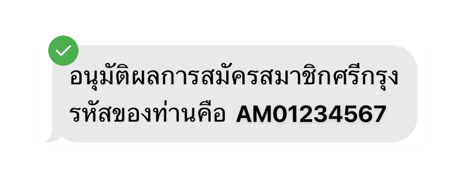
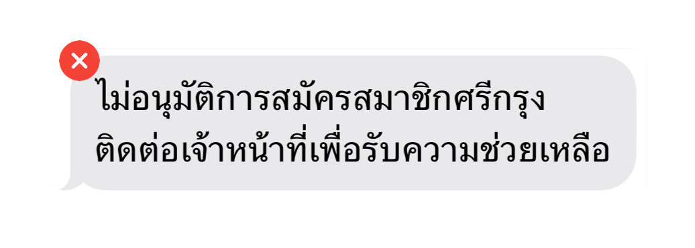

---
layout:
  title:
    visible: true
  description:
    visible: false
  tableOfContents:
    visible: true
  outline:
    visible: true
  pagination:
    visible: true
---

# ติดตามสถานะการสมัคร

หลังจากที่ผู้สมัครชำระค่าสมาชิกสำเร็จ ระบบจะทำการตรวจสอบข้อมูลการสมัครโดยเจ้าหน้าที่ ซึ่งกระบวนการนี้ใช้เวลา **ไม่เกิน 1 วันทำการ** ผู้สมัครจะได้รับการแจ้งผลการอนุมัติผ่านทาง **SMS** ตามหมายเลขโทรศัพท์ที่ได้ลงทะเบียนไว้ กรุณาตรวจสอบข้อความเพื่อทราบสถานะการสมัครของท่าน

<figure><figcaption>
SMS แสดงผลการอนุมัติการสมัครสมาชิก
</figcaption></figure>

<figure><figcaption>
SMS กรณีไม่อนุมัติการสมัครสมาชิก
</figcaption></figure>

หากไม่ได้รับ SMS ภายในเวลาที่กำหนด ให้ติดต่อผู้แนะนำของท่าน (ถ้ามี) เพื่อรับการอำนวยความสะดวก หรือสามารถติดต่อฝ่ายบริการลูกค้าเพื่อขอความช่วยเหลือได้ทันที